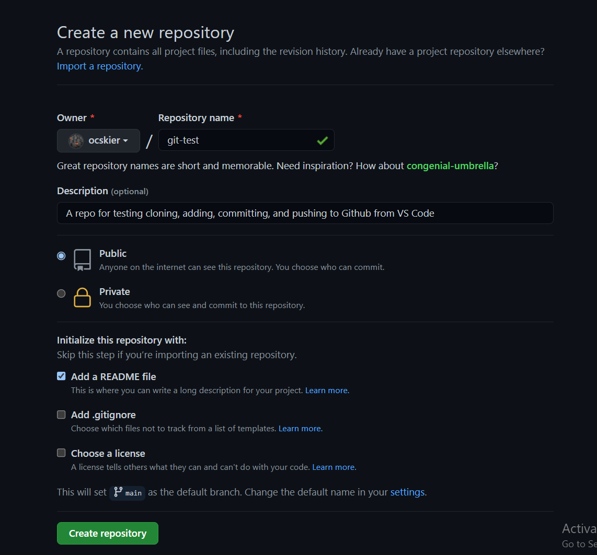
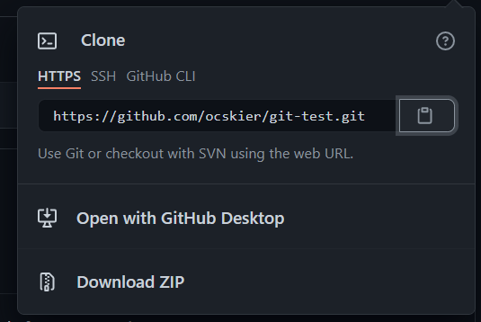

# generation-git-debrief

- [ ] Open up a VS Code window on your PC or Mac
- [ ] Select the View Tab at the top of VS Code and click the Command Palette option
- [ ] In the new popup command line start typing `Terminal: Select Default Profile` and when the option shows up select it 
- [ ] In the next dropdown click on `Git Bash` (now when we open an integrated Terminal in VS Code it should be Bash)
- [ ] Enter the command  **Ctrl + \`** (or the Terminal tab and the New Terminal option) to open an integrated terminal CLI in VS Code
- [ ] `cd ~/Desktop` (if on MacOS) else `cd ~/OneDrive/Desktop` (Windows)
- [ ] Navigate to your Github Profile on your preferred browser the link should be `https://github.com/your_github_id`
- [ ] Login if you are not already
- [ ] Click on the + sign at the top right of the page and select New Repository from the dropdown
  
  

- [ ] Fill out the form to resemble the following screenshot
  
  

- [ ] You will need to add a `Repository name`, should enter a `Description`, `Public` is fine for the activity, and lets click the Checkbox by `Add a README file` as almost every repo should have a markdown doc
- [ ] On the repo source code view lets click the <button style="color:white;background-color:green;">Code</button> button
  
- [ ] Then click the copy (or Clipboard) icon and make sure that `HTTPS` is underlined
  
- [ ] Navigate back to VS Code and in the terminal we still have open, type `git clone` and then right-click and paste the copied git url - then hit Enter
```
git clone make-sure-and-paste-the-copied-url-here
```
- [ ] You have now cloned a remote repository to your local machine for building out an application
- `cd git-test`
- `code -a .` to open the current folder in the same window (if you want to open in a new window would just be `code .`)
- [ ] Click on the `git-test` folder in the left pane workspace then click on the `README.md` file to open in the editor
- [ ] Add a new line to the README file `## Contributors`, hit Enter to go to the next line, and type your name
- [ ] Click the `File` tab at the top of VS Code and select `Save` or you can `Ctrl + S`  on Windows or `Cmd + S` on MacOS
- [ ] Navigate down to integrated Terminal again and enter
```
git status
```
- [ ] to see changes from the working directory and staging area
- [ ] Finally enter
```
git add .
git commit -m "Updates readme contributors"
git push origin main
```
- [ ] Go back to Github and see the updated code on the remote repo
- [ ] Great job everyone!
